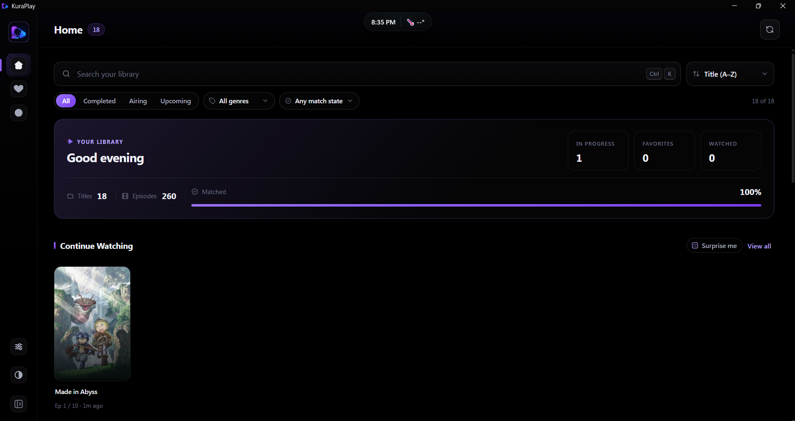
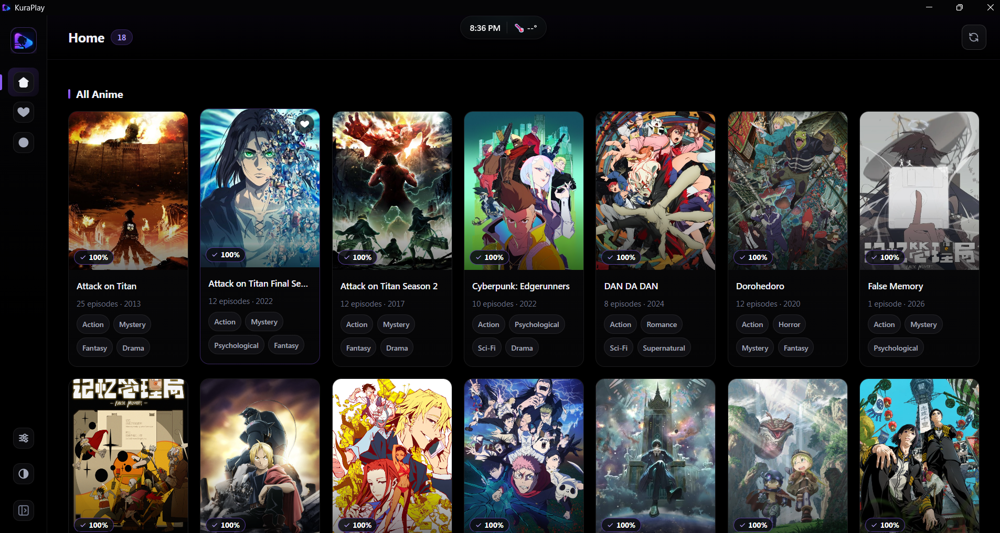
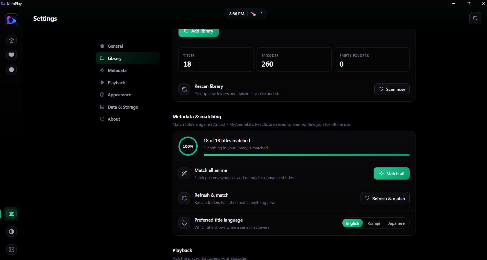
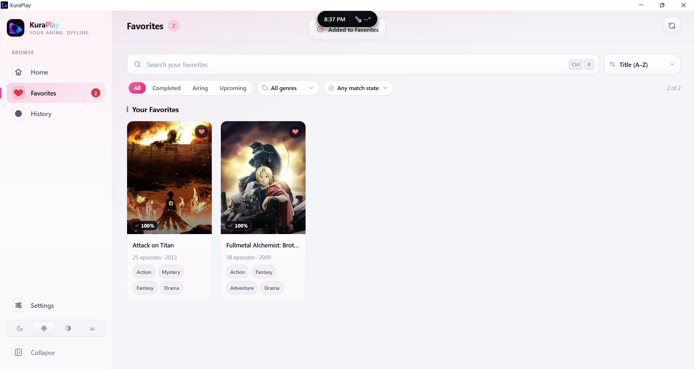

# KuraPlay

> **Latest release: [v0.4.1](https://github.com/klaynation/kuraplay/releases/latest)** — Windows / macOS / Linux installers, signed auto-updates, six interface languages.

**Your anime library. Offline.**

KuraPlay is a local-first desktop app for Windows, macOS and Linux that turns
folders of anime into a proper library: posters, metadata, watch progress,
resume-where-you-left-off playback, and a hand-off to [mpv](https://mpv.io) for
anything the built-in player can't decode. No accounts, no streaming, no
telemetry — your library never leaves your disk.

Built with [Tauri v2](https://tauri.app) (Rust backend, WebView frontend),
React 19 + TypeScript, SQLite for watch state, and localStorage as a
synchronous cache.

---

## Screenshots

| | |
|:---:|:---:|
| <br>*Home: greeting dashboard, library stats, Continue Watching* | <br>*Library grid: matched metadata, descriptive tags, favorites* |
| <br>*Settings: library folders, matching, playback, themes* | <br>*Light theme + pink accent — 4 themes × 5 accents* |

---

## Features

- **Multi-library scanning** — point it at as many folders or drives as you
  like; series, episodes and local art (`poster/cover/folder/thumb/fanart`)
  are discovered automatically.
- **Metadata, online or fully offline** — AniList → Jikan (MyAnimeList) →
  local Kodi-style `.nfo` files → folder-name fallback, in that order.
  Results are cached per-folder in `animeoffline.json` and in-app. Preferred
  title language: English, Romaji or Japanese.
- **Built-in player** — resume positions to the second, completion tracking,
  next-up countdown, keyboard-driven (`Space`, `←/→`, `0–9`, `F`, `M`, `N/P`),
  auto-hiding chrome, codec-failure fallback card.
- **mpv integration** — resolution chain: user override → bundled binary
  (Windows releases) → system PATH → common install folders.
- **Continue Watching** — series-level, Netflix-style: resumes the in-progress
  episode or queues the next unwatched one; disappears only when the series
  completes. Per-episode menu: rewatch, mark watched/unwatched, drag the
  resume position.
- **Fully offline after first sync** — posters are cached to disk on first
  sight; afterwards the library renders with zero network.
- **Self-healing paths** — move the library to another drive or rename the
  root; the next scan re-links history, favorites and cached metadata by
  relative-path suffix matching.
- **Signed auto-updates** — GitHub Releases as the update server; every update
  is signature-verified before install. Offline = silent no-op, never an error.
- **Six interface languages** — English, Español, Français, Deutsch,
  Português (Brasil), 日本語 — plus user-installable language packs: drop a
  JSON file into `<app-data>/langs/` and restart.
- **Favorites, history, backups** — one JSON export/import for history,
  favorites and settings.
- **Theming** — 4 themes (Dark, Light, OLED Black, Dim) × 5 accent presets,
  card density control, app-level reduce-motion.

## Requirements

| | |
|---|---|
| Node.js | 20+ |
| Rust | stable, via [rustup](https://rustup.rs) |
| OS packages | [Tauri v2 prerequisites](https://v2.tauri.app/start/prerequisites/) |
| mpv | optional at dev time; bundled automatically in Windows release builds |

## Development

```bash
git clone https://github.com/klaynation/kuraplay.git
cd kuraplay
npm install
npm run tauri dev        # hot-reloading app
```

Gates before committing:

```bash
npm run build            # tsc --strict + vite build
cd src-tauri && cargo check
```

### mpv at dev time

```powershell
powershell -ExecutionPolicy Bypass -File scripts/fetch-mpv.ps1
```

Downloaded binaries are git-ignored; CI fetches its own copy.

## Project structure

```
src/            React frontend (App.tsx, components/, i18n/, styles in App.css)
src/i18n/       locale dictionaries + pack loader (natural-key i18n)
src-tauri/      Rust backend
  src/lib.rs    commands: config, metadata, player resolution, updater, DWM theming
  src/db.rs     SQLite schema + queries (watch progress, favorites)
  capabilities/ Tauri permission scopes
scripts/        fetch-mpv.ps1, build-latest-json.mjs (CI updater endpoint)
docs/           screenshots
.github/        release workflow (3-platform matrix + latest.json job)
```

## Where your data lives

All state is local, under the platform app-data directory
(`%LOCALAPPDATA%\com.charlton.animeoffline` on Windows,
`~/Library/Application Support/…` on macOS, `~/.config/…` on Linux):

- `configuration.json` — library paths, mpv override
- `anime_offline.db` — SQLite watch progress + favorites (WAL mode)
- `posters/` — cached cover art for offline rendering
- `langs/` — drop-in user language packs

localStorage holds the synchronous cache (themes, accents, UI prefs) and is
reconciled against SQLite on launch — newest `lastOpenedAt` wins.

## Releases & updates

Pushing a `v*` tag builds Windows, macOS and Linux in parallel and attaches
installers (`.msi`/`.exe`, universal `.dmg`, `.AppImage`/`.deb`) plus a signed
`latest.json` to a draft GitHub release:

```bash
git tag v0.4.2
git push origin v0.4.2
```

Keep tag == `tauri.conf.json` version == `package.json` version; the updater
compares them. Local one-off builds: `npm run tauri build`.

## Roadmap

KuraPlay is feature-complete for its offline-first mission as of v0.4.x.
Deliberately parked pending demand: online Discover tab, account login/sync,
cloud backups. Want one? Open an issue — demand is the roadmap.

## Licensing notes

KuraPlay is MIT-licensed — see [LICENSE](LICENSE).

| Component | License | How it ships |
|---|---|---|
| [mpv](https://mpv.io) | GPL-2.0-or-later / LGPL-2.1+ | Bundled binary on Windows only; separate process, not linked |
| [Tauri](https://tauri.app) | MIT / Apache-2.0 | Linked |
| [React](https://react.dev) | MIT | Bundled in frontend |
| [rusqlite](https://github.com/rusqlite/rusqlite) | MIT | Linked |
| AniList / MyAnimeList (Jikan) metadata | respective API terms | Fetched at runtime, cached locally |

## Acknowledgements

Metadata courtesy of [AniList](https://anilist.co) and
[MyAnimeList](https://myanimelist.net) (via the Jikan API). Playback by
[mpv](https://mpv.io). Icons hand-drawn in-house.
